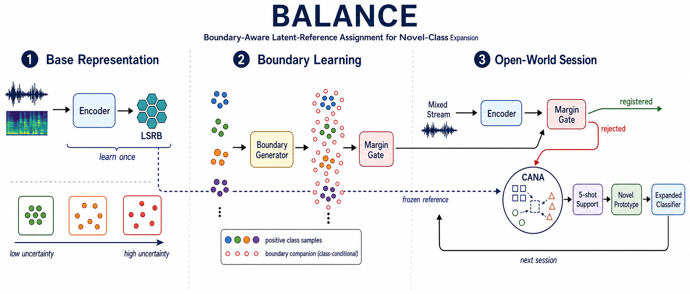

# BALANCE: Boundary-Aware Latent-Reference Assignment for Novel-Class Expansion

BALANCE addresses few-shot class-incremental audio classification in an open-world
stream. At each incremental session, the system must retain registered classes,
reject unfamiliar inputs, discover emerging classes, and register them from a
small support set.



The implementation combines the following method components:

- **Latent Structure Reference Bank (LSRB):** a frozen set of latent reference
  structures learned during base training and reused across sessions;
- **Margin-based Open-World Gate:** an adaptive score-margin decision that
  separates registered samples from novel-class candidates;
- **Capacity-Aware Novel-Class Assignment (CANA):** balanced, label-free
  assignment of rejected candidates to the available emerging-class slots;
- **Five-shot novel prototypes:** class representatives constructed from the
  current audio encoder and the labeled support episode;
- **Dynamic classifier expansion:** session-wise registration of new classes
  while preserving the previously registered classifier rows.

No network access is required during training or evaluation. Datasets,
checkpoints, Python packages, and optional pretrained artifacts must be available
locally before a run starts.

## Supported protocols

| Protocol | Dataset identifier | Base classes | Incremental sessions |
|---|---|---:|---:|
| LS-100 | `librispeech` | 80 | 4 sessions, 5 classes per session |
| NS-100 | `nsynth-100` | 80 | 4 sessions, 5 classes per session |
| FSC-89 | `FMC` | 69 | 4 sessions, 5 classes per session |

Session 0 evaluates the base classifier. Sessions 1--4 evaluate open-world
rejection, novel-class registration, and continual classification.

## Environment

The tested package versions are listed in `requirements.txt`. For a fully
offline installation, prepare a local wheel directory on a connected machine,
transfer it with the repository, and install without contacting a package index:

```bash
python -m pip install --no-index \
  --find-links "$BALANCE_WHEELHOUSE" \
  -r requirements.txt
```

Run the preflight check before launching an experiment:

```bash
bash scripts/offline_preflight.sh
```

By default, preflight validates source files, YAML configurations, offline
guards, and imports the core modules. It does not require datasets or
checkpoints. Set any of the following variables to validate local assets as
well:

| Variable | Expected value |
|---|---|
| `BALANCE_LS100_DATA` | LS-100 dataset directory |
| `BALANCE_NS100_DATA` | NS-100 dataset directory |
| `BALANCE_FSC89_DATA` | FSC-89 dataset directory |
| `BALANCE_NS100_METADATA` | optional NS-100 metadata directory if not below the dataset root |
| `BALANCE_FSC89_METADATA` | directory containing the FSC-89 split CSV files |
| `BALANCE_LS100_CHECKPOINT` | LS-100 base checkpoint |
| `BALANCE_NS100_CHECKPOINT` | NS-100 base checkpoint |
| `BALANCE_FSC89_CHECKPOINT` | FSC-89 base checkpoint |
| `BALANCE_LSRB_CHECKPOINT` | LSRB-trained checkpoint used by the LS-100 command |
| `BALANCE_FSC89_GEOMETRY` | base-geometry artifact used by the FSC-89 command |

Set `BALANCE_REQUIRE_ASSETS=1` to require every listed dataset and artifact during
preflight.

## Running the three datasets

Set the local dataset and checkpoint variables listed above, then use the single
release launcher. It fixes the public protocol to current-encoder five-shot
prototypes, label-free CANA alignment, and independently reset repeats:

```bash
bash scripts/run_balance.sh ls100
bash scripts/run_balance.sh ns100
bash scripts/run_balance.sh fsc89
```

The default is 50 repeats. A shorter offline smoke run can be selected without
changing the protocol:

```bash
BALANCE_REPEATS=1 bash scripts/run_balance.sh ls100
```

Set `BALANCE_LSRB_CHECKPOINT` to run the full LSRB model for a dataset. If it is
omitted, the same launcher runs the explicitly identifiable no-LSRB ablation.
The launcher validates every supplied file locally and never attempts a download.

All commands write only to local checkpoint, log, and result directories. The
generated outputs are excluded from version control.

## Repository layout

```text
configs/             dataset and experiment configurations
data/                LS-100, NS-100, and FSC-89 dataset loaders
models/              BALANCE encoder, classifier, and training components
scripts/             offline checks and reproducible launch utilities
tests/               unit tests for open-world metrics and method components
tools/               LSRB construction and validation utilities
utils/               metrics, sampling, and shared utilities
network.py            audio frontend and BALANCE network definition
threshold_free.py     adaptive open-world decision and evaluation
train_unopenset.py    main training and evaluation entry point
```
